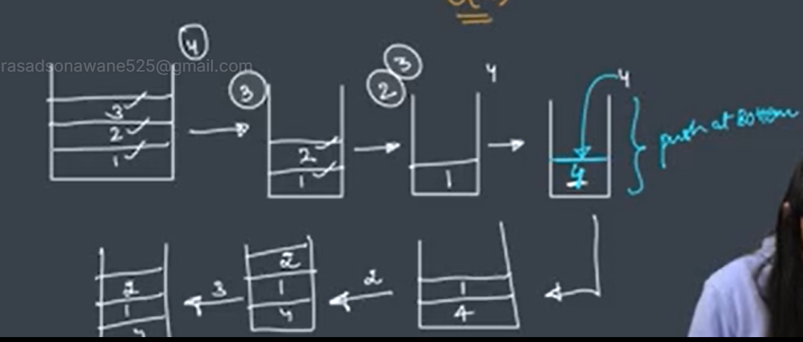
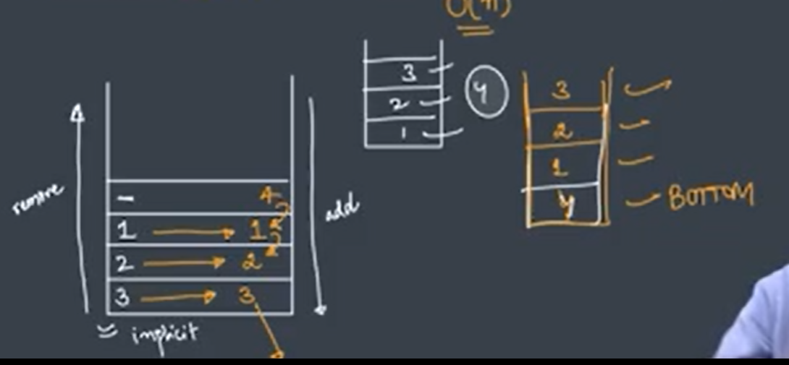
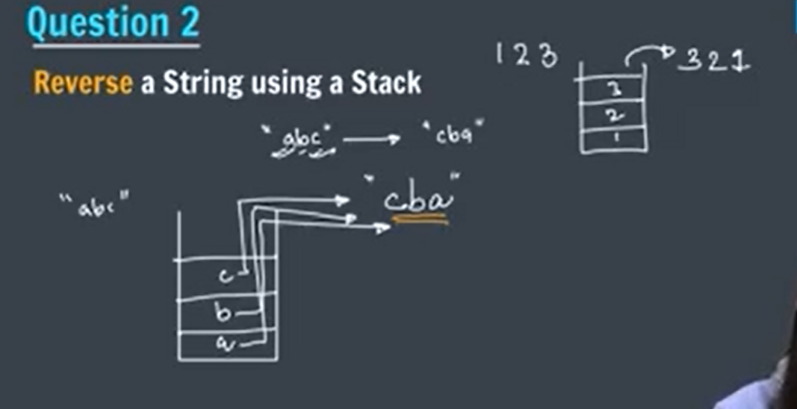
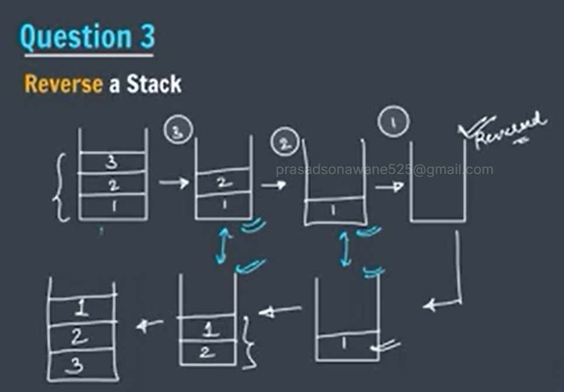
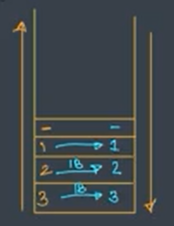
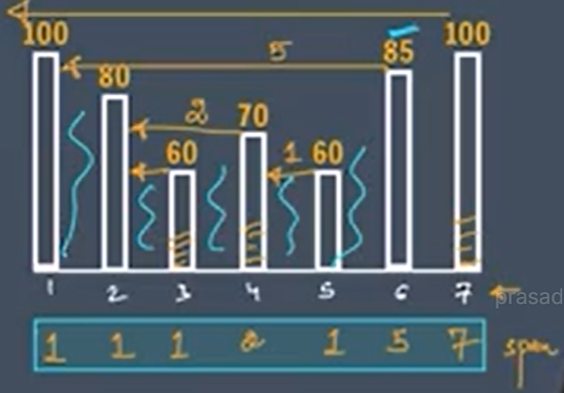

# stack

The stack is a linear data structure that is used to store the collection of objects. It is based on </b>Last-In-First-Out (LIFO)</b>. Java collection framework provides many interfaces and classes to store the collection of objects. One of them is the Stack class that provides different operations such as push, pop, search, etc.

# stack opration
1. Push O(1) -Add Element 
2. push O(1) -Remove Element 
3. Peek O(1)- retrive or fetched frist element in Stack (Jakana)

Push Opratin in Linked List :- 

pop Opratin in Linked List :-

* Collection Framework

  Stack<Integer> s=new Stack<>();

# Asked Question

1. Push at the Bottom of the Stack ?

Ans ->

* Apporch : - Use Recursion

1. Pop all element in Given stack
2. push Element 
3. push all Remove Element in stack

.

------------------------------------------------------------------***-----------------------------------------------------------------------

2. Reverse a String using a Stack ?
Ans-> Apporach

------------------------------------------------------------------***-----------------------------------------------------------------------

3. Reverse a Stack

Ans -> Use Recursion Apporch
1. Pop All element in stack
2. Push remove element at the Bottom of Stack.
3. if we are pushing element at botton position than next element is at bottom and inside element get top position.

# Stack visualizetion

------------------------------------------------------------------***-----------------------------------------------------------------------

## Most Important Question

4. Stock Span Problum
 
Ans -> 

Note :- 
    Stock :- its given in All Question.
    span :-max no of consecutive days for which price <= todays price   
    "which stock is grater or equl to of curr price as comparing with Previus Stock price calculate Diff between tham"

