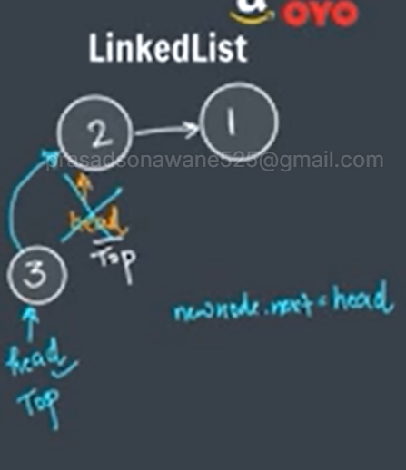
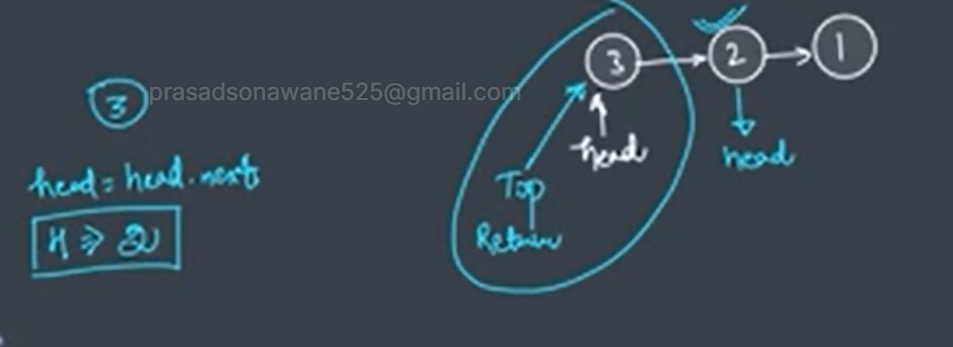

# stack

The stack is a linear data structure that is used to store the collection of objects. It is based on </b>Last-In-First-Out (LIFO)</b>. Java collection framework provides many interfaces and classes to store the collection of objects. One of them is the Stack class that provides different operations such as push, pop, search, etc.

# stack opration
1. Push O(1) -Add Element 
2. push O(1) -Remove Element 
3. Peek O(1)- retrive or fetched frist element in Stack (Jakana)

Push Opratin in Linked List :- 

pop Opratin in Linked List :-

* Collection Framework

Stack<Integer> s=new Stack<>();